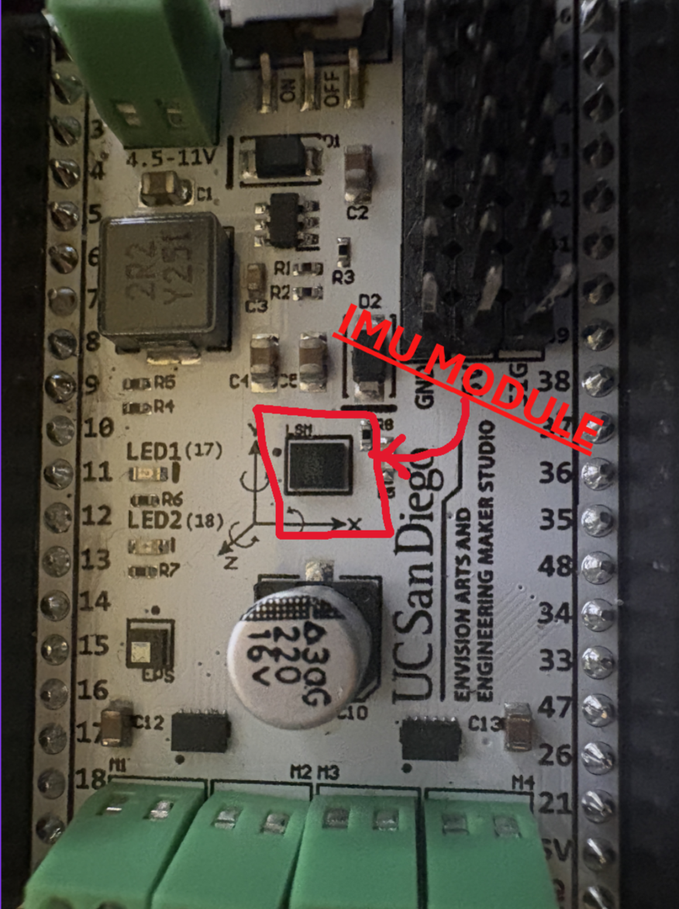
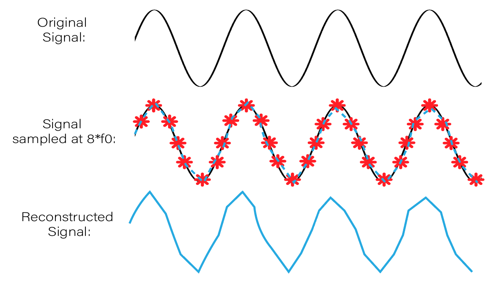
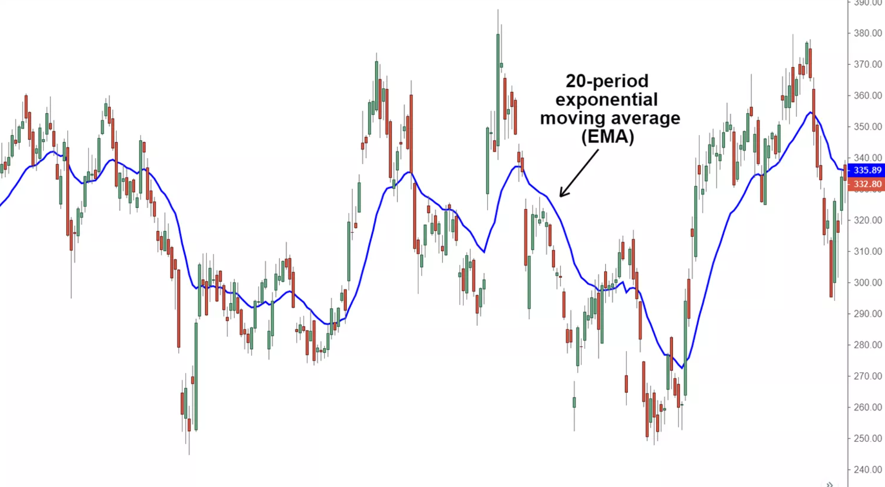
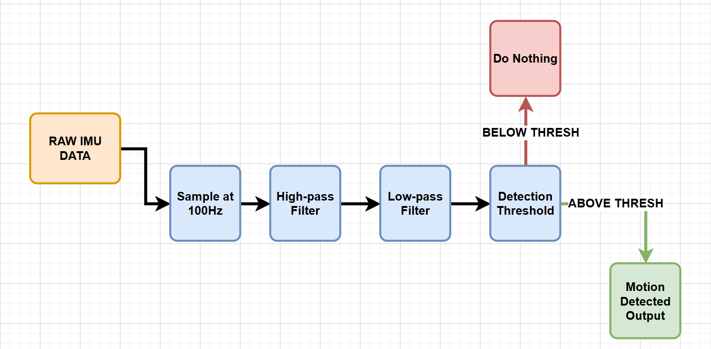
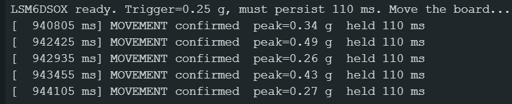

# IMU Module Signal Processing Tutorial

*Derrick Burton ECE 196 SP26*

---

## Abstract
This tutorial demonstrates how to process the signals a microcontroller (an ESP32 chip here) receives from IMU module (LSM6DSOX here) in Arduino. Readers will be able to turn the IMU module's continuous garbled stream of data into fine-tuned motion detection. Specifically, the signal processing steps readers will learn through this tutorial are sampling and filtering. 


## Introduction


### Tutorial Objectives
- Learn how to use the ESP32 chip to sample data from the IMU module.
- Learn how to filter the sampled data from the IMU module.
- Implement fine-tuned motion detection using thresholds on the filtered and sampled data. 

### Needed Materials

- ESP32-S3 Dev Board (the board from earlier mini projects).
- Motion Shield with IMU module (LSM6DSOX).
- USB-C cable for programming and serial monitor.

### Software/Imports
Install via Arduino Library Manager, and choose **Install All** so dependencies come too:

- **Adafruit LSM6DS** (provides the `Adafruit_LSM6DSOX` class)
- **Adafruit Unified Sensor** and **Adafruit BusIO** (dependencies — without them the class won't compile)
```cpp
#include <Wire.h>
#include <Adafruit_Sensor.h>
#include <Adafruit_LSM6DSOX.h>
```

## Hardware Setup
The IMU is already on the Motion Shield, so the hardware setup is easy, just place the motion shield pins into the dev board. Here's the pins we use on the motion shield:

| Signal              | ESP32 pin |
|---------------------|-----------|
| I²C SDA             | GPIO 8  (in Arduino)  |
| I²C SCL             | GPIO 9  (in Arduino)  |


## Intro Concept/Theory 

### Signal Processing: Sampling Concept

The accelerometer outputs a continuous physical quantity, but a microcontroller can only look at it at discrete instants. **Sampling** is the act of reading that signal at a fixed rate, the *sample rate* `f_s`.

To determine how fast we must sample to retain the integrity of the original signal we take a fundamental ECE45 concept, the Nyquist sampling theorem. According the the Nyquist sampling theorem, we retain signal integrity if we sample and twice the frequency of the original signal. So, since small scale handling occurs around at most 40-50 Hz, we sample at 100Hz. (The LSM6DS3's output data rate, or ODR, has no exact 100 Hz setting; we use its closest option, **104 Hz**, and poll at 100 Hz.)

> *The sampling theorem is a core result from ECE45.*


### Singal Processing: Filtering Concept
A raw reading from the IMU module intermixes three things: (a) the constant **gravity** vector (~9.8 m/s² in some direction), (b) the **dynamic acceleration** we actually care about, and (c) **sensor noise**. We utilize two filters to pick these apart.

Both are **exponential moving averages (EMA)**, the simplest first-order IIR low-pass filter:

```
y[n] = y[n-1] + alpha * (x[n] - y[n-1])
```

A small `alpha` means the output reacts slowly (lets only low frequencies through); a large `alpha` reacts quickly. For small `alpha`, the −3 dB cutoff frequency is approximately:

```
f_c ≈ (alpha * f_s) / (2*pi)
```


We use this twice:

1. **High-pass (gravity removal)** We perform a *slow* EMA on the raw reading to estimate where gravity is pointing, we then **subtract that estimate** from the raw reading, we're left with dynamic acceleration. A slow low-pass that is subtractede essentially acts as a high-pass.. With `alpha = 0.02` at 100 Hz, the gravity tracker has a cutoff of about `0.02 * 100 / (2π) ≈ 0.32 Hz`. This is slow enough to follow tilting but not lifting.
2. **Low-pass (noise smoothing).** We then run a *faster* EMA on the magnitude of the previously computed dynamic acceleration to eliminate any single-sample spikes and sensor hash. With `alpha = 0.35`, the cutoff is about `0.35 * 100 / (2π) ≈ 5.6 Hz`. This is smooth, but still fairly responsive.

## Primary Teaching Section — Build it step by step

> Now that the necessary concepts have been conveyed, the below diagram indicates how we intend to combine them for tunable motion detection:



#### Constants & state

```cpp
#define I2C_SDA_PIN  8
#define I2C_SCL_PIN  9
#define IMU_I2C_ADDR 0x6A

#define SAMPLE_HZ           100
#define SAMPLE_INTERVAL_MS  (1000 / SAMPLE_HZ)
#define GRAVITY_ALPHA       0.02f   // gravity tracker  (~0.3 Hz)
#define MOTION_ALPHA        0.35f   // motion smoother  (~5 Hz)
#define MOVE_THRESHOLD_G    0.25f   // trigger level
#define RELEASE_RATIO       0.50f   // hysteresis: release at 0.5x trigger
#define MIN_MOVE_MS         110     // motion must persist this long
#define REPORT_COOLDOWN_MS  500     // min gap between reported events
#define G_MPS2              9.80665f

Adafruit_LSM6DSOX imu;

float gX = 0, gY = 0, gZ = 0;       // gravity estimate (m/s^2)
float motion = 0;                   // smoothed dynamic-acceleration magnitude
bool above = false, reported = false;
uint32_t aboveSince = 0, lastReport = 0, lastSample = 0;

const float TRIG_MPS2 = MOVE_THRESHOLD_G * G_MPS2;   // trigger in m/s^2
const float REL_MPS2  = TRIG_MPS2 * RELEASE_RATIO;   // release in m/s^2
```

Every stage starts from one X/Y/Z reading, so you should wrap that in a helper:

```cpp
bool readAccel(float &x, float &y, float &z) {
  sensors_event_t a, g, t;
  if (!imu.getEvent(&a, &g, &t)) return false;
  x = a.acceleration.x; y = a.acceleration.y; z = a.acceleration.z;
  return true;
}
```

### Step 0 — Set up the IMU

For setting up the IMU, start I²C on the shield's pins, inititalize the sensor, configure the accelerometer, power the gyro down, and seed the gravity estimate so the first samples don't begin with a false-trigger.

```cpp
void setup() {
  Serial.begin(115200);
  Wire.begin(I2C_SDA_PIN, I2C_SCL_PIN);             // SDA=8, SCL=9
  if (!imu.begin_I2C(IMU_I2C_ADDR, &Wire)) {        // stop if the IMU isn't found
    Serial.println("ERROR: IMU not found at 0x6A.");
    while (1) delay(100);
  }
  imu.setAccelRange(LSM6DS_ACCEL_RANGE_4_G);
  imu.setAccelDataRate(LSM6DS_RATE_104_HZ);         // ~100 Hz ODR
  imu.setGyroDataRate(LSM6DS_RATE_SHUTDOWN);        // gyro unused

  const int N = 64;                                 // seed gravity from an average
  float sx = 0, sy = 0, sz = 0, x, y, z;
  for (int i = 0; i < N; i++) {
    if (readAccel(x, y, z)) { sx += x; sy += y; sz += z; }
    delay(SAMPLE_INTERVAL_MS);
  }
  gX = sx / N; gY = sy / N; gZ = sz / N; motion = 0;
  Serial.printf("LSM6DSOX ready. Trigger=%.2f g, must persist %d ms. Move the board...\n",
                MOVE_THRESHOLD_G, MIN_MOVE_MS);
}
```

### Step 1 — Sample at a fixed rate

Inside `loop()`, a `millis()` timer reads one sample exactly every `SAMPLE_INTERVAL_MS` (10 ms = 100 Hz). Stages 2–4 all live inside this same `loop()`:

```cpp
void loop() {
  uint32_t now = millis();
  if (now - lastSample < SAMPLE_INTERVAL_MS) return;   // not time yet
  lastSample = now;

  float ax, ay, az;
  if (!readAccel(ax, ay, az)) return;                  // skip on a read error
```

### Step 2 — High-pass: track gravity, then subtract it

```cpp
  gX += GRAVITY_ALPHA * (ax - gX);                     // slow EMA tracks gravity
  gY += GRAVITY_ALPHA * (ay - gY);
  gZ += GRAVITY_ALPHA * (az - gZ);
  float dX = ax - gX, dY = ay - gY, dZ = az - gZ;
  float dynMag = sqrtf(dX*dX + dY*dY + dZ*dZ);         // dynamic acceleration
```

### Step 3 — Low-pass: smooth the motion signal

```cpp
  motion += MOTION_ALPHA * (dynMag - motion);          // fast EMA smooths it
```

### Step 4 — Detect: threshold + persistence + hysteresis + cooldown

A single sample over threshold isn't enough, `motion` must *stay* above `TRIG_MPS2` for `MIN_MOVE_MS`. A lower release level (`REL_MPS2`) gives hysteresis so the state doesn't chatter, and `REPORT_COOLDOWN_MS` stops one motion from firing repeatedly. This closes `loop()`:

```cpp
  if (motion >= TRIG_MPS2) {
    if (!above) { above = true; aboveSince = now; }
    if (!reported && now - aboveSince >= MIN_MOVE_MS) {        // held long enough?
      if (now - lastReport >= REPORT_COOLDOWN_MS) {            // cooldown gate
        Serial.printf("[%8lu ms] MOVEMENT confirmed  peak=%.2f g  held %lu ms\n",
                      (unsigned long)now, motion / G_MPS2,
                      (unsigned long)(now - aboveSince));
        lastReport = now;
      }
      reported = true;
    }
  } else if (motion < REL_MPS2) {                              // settled -> re-arm
    above = false;
    reported = false;
  }
}
```


### Testing & debugging

- **Stream while tuning:** set `DEBUG_STREAM` to `1` to print `motion` (in g) and watch the Serial Monitor at 115200 baud.
- **Pick the threshold from data:** note the resting value (near 0) and the peak when you lift the board, then set `MOVE_THRESHOLD_G` between them. Re-tune for *this* chip.
- **Tune like this:** if taps still triggering (and you don't want them to) then raise `MIN_MOVE_MS`. If motion occurs you want to detect, but the serial monitor missed it, then lower the threshold. If reports repeat too frequenty, then raise the cooldown.
- **If `begin_I2C` fails:** check the shield is seated, try address `0x6B`, and confirm the chip ID (see the "Verify your chip" note above).

>If your code is working, your serial monitor should look like this:



---

## Example — How I used this in my final project

I implemented this tutorial on my team's own final project. Our project was Pilluxe, a smart pillbox and iOS app combined, I used the IMU to tell the pillbox when to power and depower the battery indicator LEDs. When the Pillbox is lifted (threshold adjusted for this), the battery indicator LEDs will light for 30 seconds then *turn off*. This allows us to **conserve battery** but still display the battery level to the user when needed.


---

## Additional Resources


- **[ECE45/ECE101]** these courses are where the sampling theorem and first-order filtering come from. This was the backbone of the whole tutorial.
- [Adafruit LSM6DS Arduino guide](https://learn.adafruit.com/lsm6dsox-and-ism330dhc-6-dof-imu/arduino) The Adafruit library and guide was essential for me to figure out how to use the LSM6DSOX library and module.
- **AI-use Disclosure:** I used Claude to help debug, annotate, and assist in my code. The Adafruit library was mostly sufficient so I didn't need it much, but it was useful when I got stuck. Alongside that, I used Claude to help clean up my writing.


